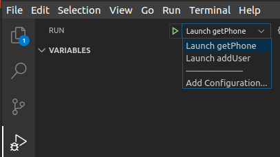

# serviceability-dotnet-samples

## Overview

These C# samples demonstrate how to use DotNet Core packages to interact with CUCM Serviceability APIs

[Serviceability API site on DevNet](https://developer.cisco.com/site/sxml/)

**Tested using:**

* Ubuntu 22.04
* DotNet Core 8.0
* CUCM 12.5/14/15
* Visual Studio Code

Try this out in the [DevNet Sandbox Collaboration 12.5 lab](https://devnetsandbox.cisco.com/RM/Diagram/Index/97563de1-5ace-4c0c-a03b-0f3eaae59d75?diagramType=Topology)

## Available samples

* `selectCmDeviceExt_HttpClient` - Risport selectCmDeviceExt sample script, using DotNet Core HttpClient. Filters by device name, passing in two specific device names (`<selectCmDeviceExt>`)

* `perfmonCollectCounterData` - Demonstrates retrieving/parsing the performance counter data from a specific object, in this case all Hunt Pilots. (`<perfmonCollectCounterData>`)

## Getting started

* From a terminal, use `git` to clone this repo to your PC, then change into the new directory:

    ```bash
    git clone https://www.github.com/CiscoDevNet/serviceability-dotnet-samples
    cd serviceability-dotnet-samples
    ```

* Install the DotNet Core SDK 3.1:

    ```bash
    sudo apt install dotnet-sdk-3.1
    ```

* Install the CUCM Tomcat web service API HTTPS certificate:

    * Download the certificate from your target CUCM server:

        ```bash
        echo -n | openssl s_client -connect ds-ucm1251.cisco.com:8443 | sed -ne '/-BEGIN CERTIFICATE-/,/-END CERTIFICATE-/p' > cucm.crt
        ```

    * Copy it to the local certificate trust store directory:

        ```bash
        sudo cp cucm.crt /usr/local/share/ca-certificates/
        ```

    * Update the OS certificate trust list:

        ```bash
        sudo update-ca-certificates
        ```

* Install needed DotNet dependencies:

    ```bash
    dotnet restore
    ```

* Open the project directory in Visual Studio Code:

    ```bash
    code .
    ```

* Rename `.env.example` to `.env`, and edit it to specify your CUCM address and API user credentials (be sure to save the file!)

    Roles required per Serviceability APIs:

    * **Risport** 

        - `Standard CCM Admin Users` (provides access to the CCMAdmin domain, but not to the CCMAdmin web UI)
        - `Standard SERVICEABILITY Read Only`

* To run a specific sample, open the **Run** tab in VS Code, select the sample from the launch dropdown, and click the green **Start Debugging** arrow (or press **F5**)

    

## Hints

* To enable printing debug output of the request/response body, set `Debug=True` in `.env`


